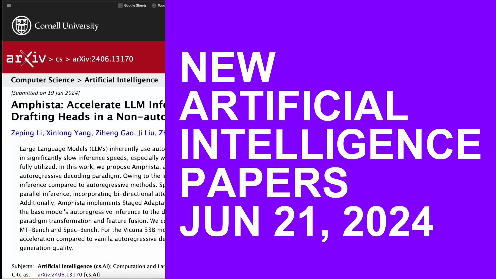

# arxiv-summaries-workflow

This repo is public access to what I use for my youtube video weekly AI paper breakdowns. I don't think anybody will really find a majority of these files useful but who knows. 
https://youtube.com/playlist?list=PLPefVKO3tDxP7iFzaSOkOZnXQ4Bkhi9YB&si=J0Rmcmy-oVyAZI7I

## Repo Contents

- `arxiv-search.py` - this script downloads papers from arXiv.org according to search criteria specified in `search_terms_include.txt` and `search_terms_exclude.txt`. It assumes by default that you only want the most recent day of papers; to change this set `restrict_to_most_recent = False` inside `config.py`. Whenever you download a file the script writes the ArXiv link into `links.txt` for use later
    - `BUG` - the buttons are frequently unresponsive. I have to just mash the button and eventually it'll work. If anyone knows why `tkinter` does this pls lmk, but honeslty it's such a non-issue and I'm so tired that I'm not even gonna look it up. Likely will get fixed in future.
- `open-links.py` - this opens all of the links in `links.txt` in your browser
- `newsletter-podcast.py` - this will consume all PDFs in the `pdfs-to-summarize/` folder and use OpenAI's API to generate summaries which will go into `newsletter.txt`. It then turns this newsletter into an mp3 file for a podcast using OpenAI's TTS
- `timestamps.py` - a script that generates youtube chapter timestamps based on the pdfs that have been summarized. Hit a configurable hotkey to (I use \`) to indicate that a new yt chapter should start, and `esc` to end the script. Creates `timestamps.txt` which is what I copy & paste into my yt description. This script likely requires you go into your computer's settings and allow special permissions in order for it to monitor your keyboard
- `thumbnail.py` - creates a simple thumbnail for my YT videos after they've been recorded. Basically a screenshot is taken from the video then the right 2/3 of the screen gets overlayed with a random color and either black or white text is written on that random color. By default the text says "New AI Papers Published MMM DD YYYY" but you can change this by calling it like in the example below.
    `python thumbnail.py "path/to/video.mov" --text "Alternative\nTitle of\nYour Choice"`

- `cleanup.py` - this will take any pdf files that have been copy & pasted from `pdfs/` to `pdfs-to-summarize/` and create .md corresponding .md files before sending them into your obsidian vault. You need to specify the location of your obsidian vault in `config.py` in order for it to work. Then, it deletes all of the files that are generated by all the other scripts. I'd recommend running this after you download the repo since I may have left it populated with a bunch of files on my last push by accident
- `config.py` - Where you can change a couple settings if you'd like. 

## SETUP

1. Clone the repository to your local machine.
2. Install the required Python packages by running `pip install -r requirements.txt` in your terminal within your virtual environment
3. Obtain an API key from OpenAI and save it in a file named `key_openai.txt` in the root directory of the repository.
4. Run `cleanup.py` to get rid of all the pdf and text files that I may or may not have left in here by accident on the most recent push
5. If you don't use obsidian then open `config.py` and set `send-to-obsidian = False`. If you plan to send files to an Obsidian vault then open `config.py` and define directories for `your/obsidian/vault/location/here` and `your/obsidian/vault/location/here/attachments-folder`. Also inside `config.py` you can edit `frontmatter_lines` to fit your tagging system
6. Maybe peruse `config.py` to check settings and try to gain a better understanding of this monstrocity I've created. I suggest editing `prompts` to fit your use-case.

## USAGE

1. Write out your search terms in `search_terms_include.txt` and `search_terms_exclude.txt` to fit your use-case. Each search term should be on its own line. If you just want all of today's newest papers then leave both blank. For me personally I just exclude papers that I know I'm not going to be interested, for example anything related to the medical field. Also if you'd like to include more than the most recent day's papers then open up `config.py` and set `restrict_to_most_recent = False`. By default the maximum number of papers to include in search is 500, but again you can change this in `config.py`.
2. Run `arxiv-search.py`, wait for it to finish printing out every title and link to console, and then it should create a little app window. Expand this window and then you'll see a bunch of buttons with names of papers. Click on a paper and it'll be downloaded to `pdfs/`
    - If no papers show up and you get a blank window that's just either the arXiv API or the API wrapper bugging out. Just run it a couple times until it works. preferably wait ~15 minutes 
3. Run `open-links.py` and all the papers you downloaded will pop up in your browser. Bytez is the cleanest and most useful UI i've seen for reading arxiv papers given that it splits up sections so well, has an integrated chatbot, and links to relevant youtube videos. However some bytez links give a 404 error, so as a backup i've also set it to open the arxiv links as a backup
4. If you want to publish YT vids like I do, run `timestamps.py` as close to when you hit record as possible and use the hotkey to indicate whenever you switch to a new paper. press `esc` to end that script. 
5. Run the `newsletter-podcast.py` script to generate a newsletter and podcast based on all the pdf files in `pdfs-to-summarize/`
6. With your recorded video call `python thumbnail.py "path/to/your/video.mov"` 
7. Once you're finished run `cleanup.py` to send the create corresponding markdown files and send the pdfs in `pdfs-to-summarize/` to your obsidian vault, and then delete all files created by the previous scripts.